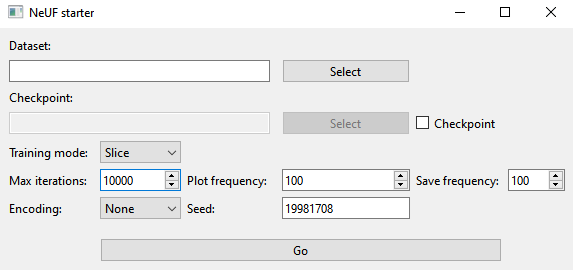
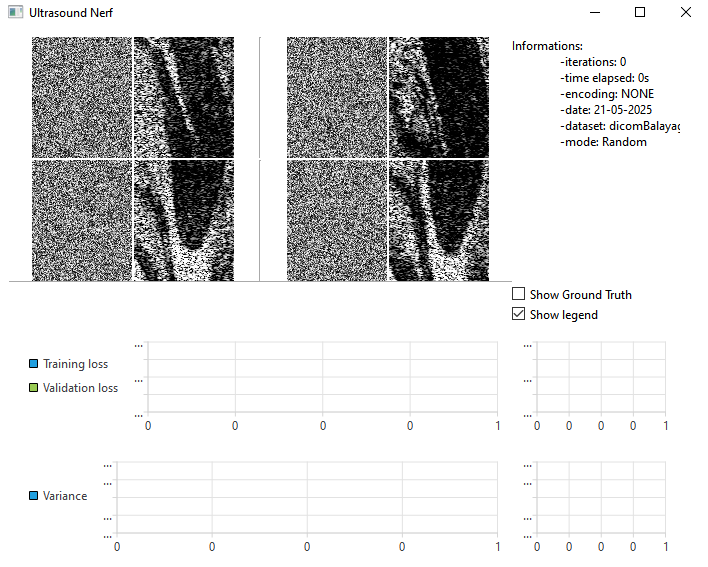
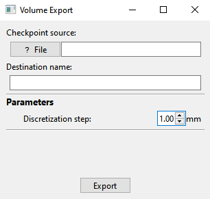
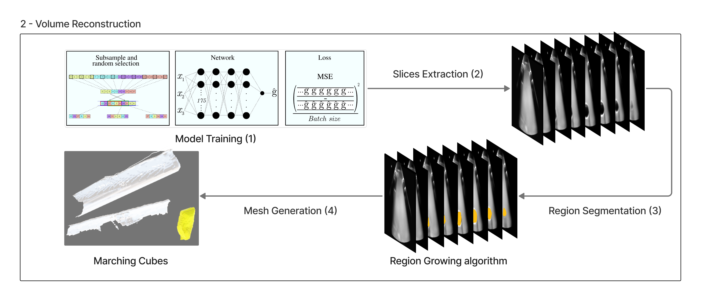

# Neural Ultrasound Field

## Requirements

To set up your python environment run the following:

```
pip install -r requirements.txt
```

> It is strongly recommended to create a virtual environment


## *Baking* the data

The first step consists in preparing the data for the training

### Input data

The *baking* process takes as input a folder containing **two** main elements:
- Ultrasound images (within the **us folder**)
- Positions of Ultrasoud sensor during acquisition (in the **infos.dat** file)

Example of **infos.dat** file:
```
107.146 -13.5714 -18.6431 -0.484502 0.515065 0.518756 0.480478 50 35
107.286 -13.4499 -18.6598 -0.484368 0.515369 0.518764 0.480278 50 35
107.347 -13.3359 -18.6531 -0.484143 0.515546 0.518867 0.480203 50 35
```

Which represents:
```
pos.x pos.y pos.z rot.w rot.x rot.y rot.z scan.width scan.height
```


### How to *bake* the data

Once you have your data organized in your input folder, you can run the *baking* script:

```
path/to/python bakeDataset.py -i path/to/input/folder -o path/to/output/
dataset.pkl

```

This should create a **.pkl** containing both image and position information madatory for the next steps.


## Training the NeUF model


Now that you have your dataset baked, it is time to train your model. To do 
so, you need to run this:
```
cd interface
path/to/python ./startwindow.py
```

You should see this window:



Specify the path of your recently generated **.pkl** file in the *dataset* field.

When all parameters are set, press the `Go` button and you should be set for the training step.

### Example with already *baked* data


To obtain results right away an example has been set up with already *baked* data. To launch it, run the following commands:


```
cd interface
path/to/python ./mainwindow.py
```

### Running Window


Either case, you should see this window:



## Exporting the volume


### Old version

Once your model has been trained, you can export it using:


```
cd interface
path/to/python ./volumewindow.py
```

You should have this window:



Select both the path of the model you want to export and the name of the exported volume.

This should create a new folder within **./volume/Generated** with three different files:
- some information about your volume (**info.txt**)
- a python script to handle the printing in **Paraview** (**para.py**)
- the generated volume (**volume.raw**)

### See your volume

To see your generated volume, you need **Paraview**. Once installed, you can click `File > Load State` and select your **para.py** and you're normally set. 

### New Version

The pipeline of the new export pipeline is described in the following figure:


> The code is located in the ***new_export_method*** folder. See below, in the table, the associated code for each step of the pipeline. 

| Pipeline Step  | Associated Code |
| ------------- | ------------- |
| Slices Extraction | [export_slices](new_export_method/export_slices.py)  |
| Region Segmentation  | [segment_roi](new_export_method/segment_roi.py)  |
| Mesh Generation | [export_segmentation](new_export_method/export_segmentation.py) |

The [main](new_export_method/main.py) script aimed to automatize the volume exporting pipeline.