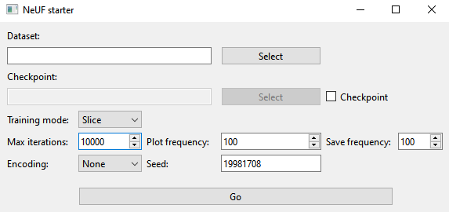
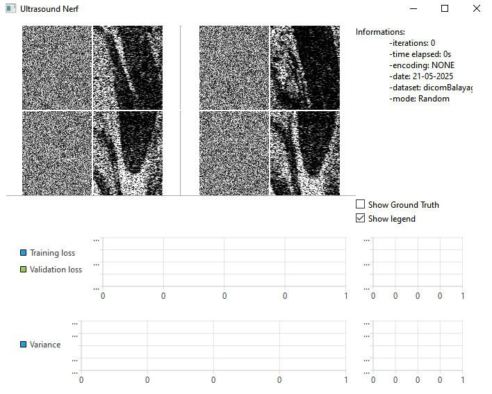
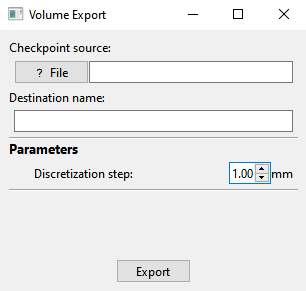
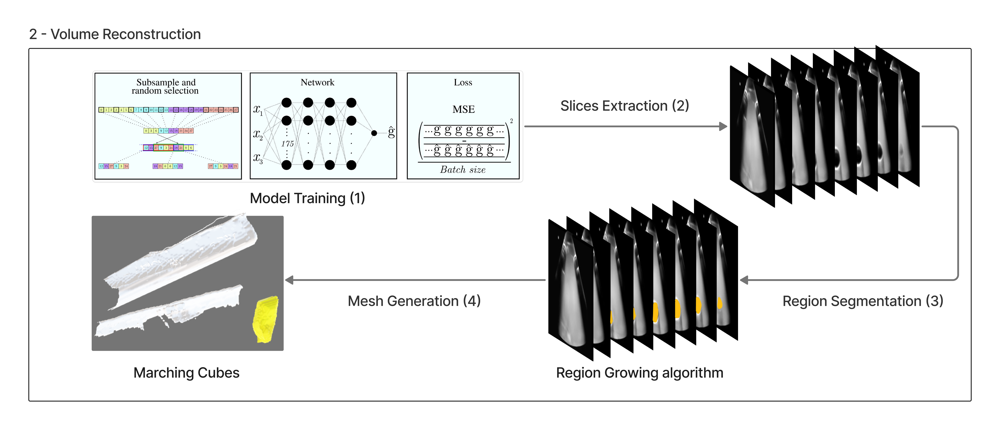

# Neural Ultrasound Field

## 项目目标与测试原则

本项目以提高最终医学超声三维重建质量为最高目标，重点关注解剖结构清晰度、几何一致性、散斑保留与区分能力、对比度、插值连续性、sagittal 一致性和伪影抑制。测试仅用于确认代码能够运行并防止数据方向、SE(3) 位姿、梯度传播、sagittal 监督及关键渲染路径回归；不增加重复或一次性的冒烟测试，整个项目最多保留一个轻量级端到端冒烟测试。每次修改只运行直接相关的最小测试集，测试通过不代表重建质量提高。实质性方法修改必须在固定数据、训练配置和重建范围下进行前后图像及相关定量指标对比；未观察到明确改善时必须标记为“尚未验证”或“未观察到改善”。

## Project layout

The repository is organized by role:

- `neuf/`: main NeUF Python package, including datasets, encoders, training, rendering, and export code.
- `jobs/pbs/`: PBS job scripts for cluster training/export runs.
- `notebooks/`: exploratory notebooks.
- `docs/`: implementation notes and experiment writeups.
- `archives/`: archived bundles.
- `artifacts/debug/`: local debug artifacts such as core dumps.
- `exports/`, `experiments/`, `logs/`, `logdir/`: generated experiment outputs.

Python code is exposed through the `neuf` package. Import it with statements such as `from neuf.dataset import Dataset`; cluster jobs live under `jobs/pbs/`.

For the point-renderer, direct-float export, structured curriculum, and pose-trajectory
ablation workflow, see [the quality-first baseline](docs/quality_first_baseline.md).

Install the project in editable mode for development, then use either module or console entry point:

```bash
python -m pip install -e .
python -m neuf --help
neuf --help
```

Without installing, run it directly from the repository with `python -m neuf`.

The standalone trajectory script can be copied and run without importing NeUF:

```bash
python plot_probe_trajectory.py --frames 242 --output-dir trajectory_output
```

## Requirements

To set up your python environment run the following:

```
pip install -r requirements.txt
```

> It is strongly recommended to create a virtual environment


## *Baking* the data

The first step consists in preparing the data for the training

### Input data

The *baking* process takes as input a folder containing **two** main elements:
- Ultrasound images (within the **us folder**)
- Positions of Ultrasoud sensor during acquisition (in the **infos.dat** file)

Example of **infos.dat** file:
```
107.146 -13.5714 -18.6431 -0.484502 0.515065 0.518756 0.480478 50 35
107.286 -13.4499 -18.6598 -0.484368 0.515369 0.518764 0.480278 50 35
107.347 -13.3359 -18.6531 -0.484143 0.515546 0.518867 0.480203 50 35
```

Which represents:
```
pos.x pos.y pos.z rot.w rot.x rot.y rot.z scan.width scan.height
```


### How to *bake* the data

Once you have your data organized in your input folder, you can run the *baking* script:

```
path/to/python -m neuf.bakeDataset -i path/to/input/folder -o path/to/output/dataset.pkl

```

This should create a **.pkl** containing both image and position information madatory for the next steps.


## Training the NeUF model


Now that you have your dataset baked, it is time to train your model. To do 
so, you need to run this:
```
cd interface
path/to/python ./startwindow.py
```

You should see this window:



Specify the path of your recently generated **.pkl** file in the *dataset* field.

When all parameters are set, press the `Go` button and you should be set for the training step.

### BARF-style probe pose optimization

The command-line trainer can jointly refine the tracked probe poses and the
NeUF field. Enable it with `--optimize-poses`:

```bash
python -m neuf \
  --dataset path/to/baked_dataset.pkl \
  --encoding Hash \
  --training-mode Random \
  --optimize-poses \
  --pose-lr 1e-4 \
  --pose-lr-end 1e-5 \
  --pose-warmup-iters 500
```

Each training slice receives a zero-initialized six-degree-of-freedom SE(3)
increment. Rotations are represented in radians and translations use the
dataset's millimetre coordinate system. The first training pose is fixed by
default to remove global gauge freedom; pass `--no-pose-anchor-first` to allow
it to move. Validation slices retain their tracked poses.

Pose parameters, optimizer state, raw SE(3) corrections, and corrected `[3, 4]`
pose matrices are stored in checkpoints under `pose_refiner_state_dict`,
`pose_optimizer_state_dict`, `pose_corrections_se3`, and
`refined_train_poses`. They follow training-slice order;
`pose_source_frame_indices` records the original frame numbers for newly baked
datasets (`-1` for legacy baked datasets). Resuming such a checkpoint restores
pose optimization unless `--no-optimize-poses` is supplied.

### Sagittal auxiliary-slice supervision

An additional MATLAB sagittal image can supervise the same NeUF field while
its position is refined jointly with the reconstruction:

```bash
python -m neuf \
  --dataset data/cerebral_data/Pre_traitement_echo_v2/Recalage/Patient0/us_recal_original/baked_dataset_physical.pkl \
  --sagittal-mat data/cerebral_data/Pre_traitement_echo_v2/Repositionnement/Patient0/data_repos_Patient0_J35_2_sag.mat \
  --sagittal-variable data_sag \
  --sagittal-weight 1.0 \
  --sagittal-points-per-iter 8192 \
  --optimize-sagittal-pose
```

The v7.3 MATLAB image is oriented automatically to the training grid and
normalized to `[0, 1]`. Its initial geometry is the tracked training slice
nearest the middle of the scan trajectory. A zero-initialized, independent
6-DoF SE(3) correction then learns both translation (millimetres) and rotation
(radians), using the same BARF-style parameterization as probe pose
optimization. Use `--no-optimize-sagittal-pose` to retain the centre pose.

At each iteration, `--sagittal-points-per-iter` image pixels contribute an MSE
term weighted by `--sagittal-weight`. The sagittal pose, optimizer, correction,
and refined `[3, 4]` matrix are saved in checkpoints. Full sagittal predictions,
targets, differences, losses, and pose statistics are also written to the run
image directory and TensorBoard at validation intervals. The dedicated
`jobs/pbs/run_neuf_pose_optimization_pbs.sh` task enables the Patient0 sagittal
file by default; set `USE_SAGITTAL=0` to disable it.

### Example with already *baked* data


To obtain results right away an example has been set up with already *baked* data. To launch it, run the following commands:


```
cd interface
path/to/python ./mainwindow.py
```

### Running Window


Either case, you should see this window:



## Exporting the volume


### Old version

Once your model has been trained, you can export it using:


```
cd interface
path/to/python ./volumewindow.py
```

You should have this window:



Select both the path of the model you want to export and the name of the exported volume.

This should create a new folder within **./volume/Generated** with three different files:
- some information about your volume (**info.txt**)
- a python script to handle the printing in **Paraview** (**para.py**)
- the generated volume (**volume.raw**)

### See your volume

To see your generated volume, you need **Paraview**. Once installed, you can click `File > Load State` and select your **para.py** and you're normally set. 

### New Version

The pipeline of the new export pipeline is described in the following figure:


> The code is located in the ***new_export_method*** folder. See below, in the table, the associated code for each step of the pipeline. 

| Pipeline Step  | Associated Code |
| ------------- | ------------- |
| Slices Extraction | [export_slices](new_export_method/export_slices.py)  |
| Region Segmentation  | [segment_roi](new_export_method/segment_roi.py)  |
| Mesh Generation | [export_segmentation](new_export_method/export_segmentation.py) |

The [main](new_export_method/main.py) script aimed to automatize the volume exporting pipeline.
